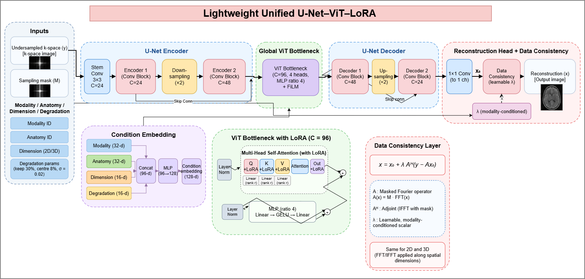

# Lightweight Unified U-Net–ViT–LoRA for Multi-Modal 2D/3D Image Reconstruction

A lightweight reconstruction network (~0.45M params in 2D, ~0.76M in 3D) that handles
X-ray, ultrasound and MRI in 2D and 3D with one architecture, using LoRA adaptation,
FiLM conditioning and a learnable data-consistency layer.



## Architecture
- **Stem conv** → **Encoder 1** (C=24) → down ×2 → **Encoder 2** (C=48) → down ×2
- **Global ViT bottleneck** (C=96, 4 heads, MLP ratio 4) with **LoRA** on q, k, v, out-proj + **FiLM** conditioning
- **Decoder 1** (C=48) → up ×2 → **Decoder 2** (C=24), skip connections by concatenation
- **1×1 head** → x₀ → **Data consistency**: `x = x₀ + λ·Aᴴ(y − A x₀)`, λ learnable and modality-conditioned
- **Condition embedding**: Modality(32) + Anatomy(32) + Dimension(16) + Degradation(16) → MLP → 128-d
- Same code for 2D and 3D (FFT/IFFT over spatial dims)

## Training protocol
1. **Stage 1** – pooled pre-training per dimensionality (2D: ChestXray + BUSI, 3D: BraTS + MRI-US-Brain), LoRA inactive.
2. **Stage 2** – per-dataset adaptation: backbone frozen; LoRA, FiLM/condition, head, DC-λ and norm affines trainable (~88K params).
3. `ours_scratch` = same architecture trained per dataset with the same budget as the baselines.

Forward model for every model/dataset: `y = M · FFT(x) + noise` (30% random lines kept, 8% centre, σ = 0.02).
Loss for all models: `L1 + 0.2 (1 − SSIM) + 0.1 · k-space L1`.

## Baselines
U-Net, Swin-UNETR (MONAI), ADMM-Net, DnCNN, VarNet.

## Repository layout
```
src/
  common.py       config, data prep, degradation operator, metrics
  models.py       baselines + UNetViTLoRA (ours)
  train.py        training / eval loops
  efficiency.py   params, FLOPs, time-per-scan
  evaluate.py     tables, Wilcoxon tests, figures
  make_readme.py  results README writer
  run_all.py      full pipeline entry point
docs/architecture.png
```

## Usage
```bash
pip install -r requirements.txt
cd src
python run_all.py --datasets chestxray busi brats mriusbrain \
  --work_dir ./recon_work --out_dir ./results_recon \
  --chestxray_root /path/to/chest_xray \
  --busi_root /path/to/Dataset_BUSI_with_GT \
  --brats_root /path/to/MICCAI_BraTS2020_TrainingData \
  --mriusbrain_root /path/to/3d-mri-ultrasound-brain-images
```
Quick smoke test without data: `python run_all.py --synthetic --quick`

Defaults assume Kaggle paths (`/kaggle/input/...`) and `/kaggle/working` outputs.

## Datasets
Chest X-ray Pneumonia, BUSI, BraTS2020, 3D MRI-Ultrasound Brain (all public on Kaggle).
Data is not included in this repo.

## Results (single Kaggle run, test split)
| Dataset | Ours PSNR / SSIM | Best baseline PSNR / SSIM |
|---|---|---|
| ChestXray (n=240) | **32.79 / 0.910** | U-Net 32.10 / 0.906 |
| BUSI (n=156) | 27.16 / 0.771 | VarNet 27.29 / 0.776 |
| BraTS2020 (n=30) | **30.96 / 0.975** | ADMM-Net 30.19 (PSNR), VarNet 0.966 (SSIM) |
| MRIUSBrain (n=5) | 26.50 / 0.823 | VarNet 27.36 / 0.842 |

Ours is best on ChestXray and BraTS2020 (all five metrics), while VarNet is slightly ahead on BUSI and
clearly ahead on MRIUSBrain. MRIUSBrain has only 5 test volumes, so differences there are not statistically
meaningful. Ablations were cut short by the time budget (only LoRA rank 4 completed).

## Citation
If you use this code, please cite the repository.
